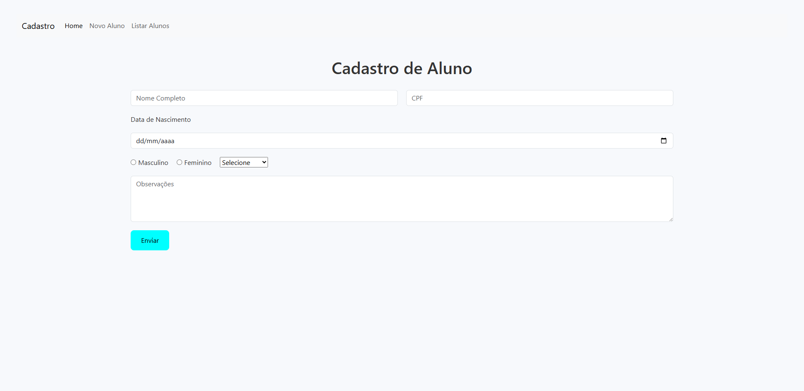
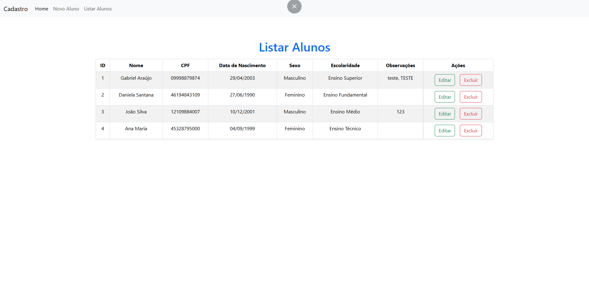

# 📚 Sistema de Cadastro de Alunos

Este projeto é um sistema simples de cadastro de alunos desenvolvido com **PHP**, **MySQL**, **JavaScript** e **Bootstrap**. Permite realizar operações de **CRUD** (Create, Read, Update, Delete) integradas a um banco de dados MySQL, com interface responsiva.

---

## 🚀 Funcionalidades

- ✅ Cadastro de alunos com validação de CPF único
- 📝 Edição e exclusão de registros
- 🔍 Listagem de todos os alunos cadastrados
- 📅 Formulário com campos de texto, datas, opções e observações
- 📂 Separação das funcionalidades por arquivos modulares

---

## 🛠️ Tecnologias Utilizadas

- **PHP** (Back-end)
- **MySQL** (Banco de dados)
- **Bootstrap 5** (Estilização e responsividade)
- **JavaScript** (Validações e interações)
- **HTML5 e CSS3**

---

## 💾 Estrutura do Banco de Dados

O projeto utiliza a base de dados `user_aluno` com a tabela `aluno`:

```sql
CREATE TABLE aluno (
	id_aluno INT AUTO_INCREMENT PRIMARY KEY,
    nome VARCHAR(100) NOT NULL,
    cpf VARCHAR(14) UNIQUE NOT NULL,
    data_nascimento DATE NOT NULL,
    sexo ENUM('Masculino', 'Feminino') NOT NULL,
    escolaridade ENUM('Ensino Fundamental','Ensino Médio',
    'Ensino Técnico','Ensino Superior') NOT NULL,
    observacoes TEXT
);
```

📌 Observações
O projeto não utiliza login/autenticação.

Foco em aprendizado de CRUD com PHP e integração com banco de dados.


⚙️ Como Executar o Projeto
1.Clone o repositório:
git clone https://github.com/gabrielaraujo2003/seu-repositorio.git

2.Importe o banco de dados no MySQL com o script da tabela.

3.Configure as credenciais de conexão no arquivo database.php.  

4.Coloque o projeto em um servidor local (como XAMPP, WAMP ou Laragon).

5.Acesse o sistema via navegador:
http://localhost/pasta-do-projeto/


## 📸 Pré-visualização




